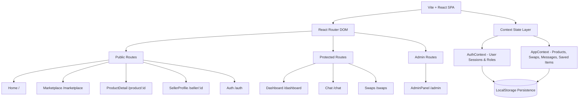

# Materiala — Art Supply Exchange 🎨♻️

> **Give Art Materials a Second Life.**  
> A curated, art-directed circular economy marketplace where Indian art students, hobbyists, designers, and professional creators buy, sell, and swap unused or lightly loved materials.

[](https://app.netlify.com/projects/materiala-art-supply)
[](https://materiala-art-supply.netlify.app)
[](https://vite.dev)
[](https://react.dev)
[](LICENSE)

---

## 🌟 Live Application & Quick Links

- **Production URL:** [https://materiala-art-supply.netlify.app](https://materiala-art-supply.netlify.app)
- **Netlify Project Console:** [app.netlify.com/projects/materiala-art-supply](https://app.netlify.com/projects/materiala-art-supply)

### 🔑 Demo Logins

Test all roles immediately using the pre-configured credentials:

| Role | Email | Password | What You Can Explore |
|---|---|---|---|
| **Regular User** | `demo@artsupply.in` | `demo1234` | Browse, buy, initiate swap requests, chat with sellers, save to collection |
| **Seller** | `arjun@art.in` | `arjun123` | Manage pre-existing active listings, create new listings, incoming offers |
| **Admin** | `admin@artsupply.in` | `admin1234` | Full access to `/admin`: user moderation, listing flags/removals, disputes |

---

## 📖 Table of Contents

- [Vision & Concept](#-vision--concept)
- [Key Features](#-key-features)
- [Design Language & Aesthetics](#-design-language--aesthetics)
- [Application Architecture](#-application-architecture)
- [Repository Structure](#-repository-structure)
- [Getting Started](#-getting-started)
- [Production Optimization & Deployment](#-production-optimization--deployment)
- [Contributing](#-contributing)
- [License](#-license)

---

## 🎯 Vision & Concept

Traditional e-commerce platforms treat creative supplies as disposable commodities. **Materiala** is designed as a **cultural community space** that celebrates the materiality of art making:

1. **Circular Creative Economy:** High-grade oil paints, watercolor pans, specialty archival papers, and sculpting tools rarely get completely used up. Materiala keeps them in studios rather than landfills.
2. **Accessible Creative Education:** Art school supplies can be prohibitively expensive. Materiala allows design students across NID, NIFT, JJ School of Art, and independent studios to access premium brands at student-friendly prices.
3. **Barter & Direct Swap:** Cash is optional. Creators can propose direct material-for-material exchanges to trade excess supplies for what their current project demands.
4. **Indian Creative Identity:** Grounded in indigenous artisanal color theory and local city creative hubs (Kolkata, Mumbai, Delhi, Bengaluru, Jaipur, Hyderabad, Chennai).

---

## 🚀 Key Features

### 🛒 1. Material Market (`/marketplace`)
- **Faceted Discovery:** Filter by Category (Paints, Paper, Brushes, Printmaking, Sculpting, Digital), Indian City, Item Condition (Like New, Gently Used, Well Loved), and Swap-Eligible listings.
- **Dynamic Search:** Real-time multi-field search scanning titles, descriptions, brand tags, and medium attributes.
- **Smart Sorting:** Price ascending/descending, newest additions, and community popularity.

### 🔄 2. Direct Material Swap System (`/swaps`)
- **Propose Barters:** Offer an item from your own inventory in exchange for any swap-enabled listing.
- **Lifecycle Management:** 4-stage pipeline for **Incoming**, **Outgoing**, **Active**, and **Completed** swaps.
- **Negotiation Actions:** Accept, reject, or mark swaps fulfilled with instant feedback.

### 💬 3. Direct Messaging (`/chat`)
- **In-App Conversations:** Chat directly with item owners to coordinate studio pickups, inspect swatch tests, or discuss condition details.
- **Real-Time Threading:** Auto-scrolling transcript, conversation switching, and timestamp formatting.

### 📊 4. Creator Studio Dashboard (`/dashboard`)
- **Listing Studio:** Publish new listings with title, category, condition grade, price, original retail price, city, swap preference, and image preview upload.
- **Inventory Controls:** Toggle listing availability, mark as sold, or archive items.
- **Saved Collection:** Bookmarked materials stored in local state for later reference.

### 🛡️ 5. Admin & Community Moderation Suite (`/admin`)
- **Platform Analytics:** Key metrics including total active inventory, verified creators, gross marketplace volume, and active barters.
- **User Oversight:** Search, inspect, and suspend or reinstate user profiles.
- **Listing Moderation:** Flag misleading descriptions or delete policy-violating items.
- **Dispute Resolution:** Review trade disputes with case logs and resolution triggers.

---

## 🎨 Design Language & Aesthetics

Materiala avoids sterile generic UI in favor of an **editorial, tangible, art-directed aesthetic**:

### Curated Color Palette
- **Warm Textured Canvas:** `--color-cream` (`#F5F0E8`)
- **Terracotta Clay:** `--color-terracotta` (`#C4603A`)
- **Deep Indigo Ink:** `--color-ink` (`#1B3A5C`)
- **Artisanal Charcoal:** `--color-charcoal` (`#1A1A18`)
- **Verdant Sage:** `--color-sage` (`#4A6741`)
- **Raw Ochre:** `--color-ochre` (`#D4A017`)

### Typography Hierarchy
- **Editorial Headlines:** *Playfair Display* (Serif elegance with literary warmth)
- **Structural Subheadings:** *Space Grotesk* (Contemporary modernist geometry)
- **Legible Interface Body:** *Inter* (High-contrast, screen-optimized readability)
- **Technical Metadata & Pricing:** *JetBrains Mono* (Catalog reference numbers and pricing precision)

### Motion & Tactility
- Micro-interactions on all cards, buttons, and badges.
- Scroll-triggered staggered entrance animations via `IntersectionObserver`.
- Accessible: Full support for `@media (prefers-reduced-motion: reduce)`.

---

## 🏗️ Application Architecture



---

## 📂 Repository Structure

```
Materiala/
├── public/
│   ├── _redirects              # Netlify client-side routing fallback
│   ├── favicon.svg             # Handcrafted terracotta palette icon
│   └── icons.svg               # SVG icon sprites
├── src/
│   ├── components/
│   │   ├── layout/             # Navbar, Footer, Mobile Drawer
│   │   ├── product/            # ProductCard, Grid, Badges
│   │   └── ui/                 # Button, Modal, Toast, EmptyState, LoadingState
│   ├── context/
│   │   ├── AuthContext.jsx     # User authentication state & mock accounts
│   │   └── AppContext.jsx      # Marketplace data, listings, chats, swaps
│   ├── data/
│   │   ├── products.js         # Realistic Indian art supply catalog
│   │   ├── users.js            # User profiles & creator bios
│   │   ├── categories.js       # Taxonomy & medium definitions
│   │   └── cities.js           # Indian hub distances and listings counts
│   ├── pages/
│   │   ├── Home.jsx            # Editorial landing page & hero visual stack
│   │   ├── Marketplace.jsx     # Search, filter sidebar & product grid
│   │   ├── ProductDetail.jsx   # Image gallery, seller bio & action modals
│   │   ├── Dashboard.jsx       # Seller inventory manager & create form
│   │   ├── Chat.jsx            # Direct buyer-seller threaded messenger
│   │   ├── SwapRequests.jsx    # Tabbed barter proposals & confirmations
│   │   ├── SellerProfile.jsx   # Public studio storefront & reviews
│   │   ├── AdminPanel.jsx      # Moderation, stats & dispute dashboard
│   │   └── Auth.jsx            # Split-screen login & onboarding
│   ├── styles/
│   │   └── global.css          # Design tokens, CSS variables & typography
│   ├── App.jsx                 # Routing table & layout wrappers
│   └── main.jsx                # Application root entrypoint
├── netlify.toml                # Netlify build configuration & redirect rules
├── vite.config.js              # Vite config with vendor chunk splitting
├── package.json
└── README.md
```

---

## 💻 Getting Started

### Prerequisites
- Node.js `18.0.0` or higher
- npm `9.0.0` or higher

### Installation

1. **Clone the repository:**
   ```bash
   git clone https://github.com/arifmoin522-a11y/Materiala.git
   cd Materiala
   ```

2. **Install dependencies:**
   ```bash
   npm install
   ```

3. **Start the local development server:**
   ```bash
   npm run dev
   ```
   Open your browser at `http://localhost:5173`.

4. **Verify build output:**
   ```bash
   npm run build
   npm run preview
   ```

---

## ⚡ Production Optimization & Deployment

### 1. Zero-Config Netlify Deployment
The repository includes both `netlify.toml` and `public/_redirects`:
```toml
[build]
  command = "npm run build"
  publish = "dist"

[[redirects]]
  from = "/*"
  to = "/index.html"
  status = 200
```
This ensures direct URLs (e.g. `https://materiala-art-supply.netlify.app/marketplace`) and browser refreshes route smoothly through the React SPA without 404 errors.

### 2. Vendor Chunk Splitting
Configured in `vite.config.js` to isolate React, React-DOM, and React-Router into a cached bundle:
```javascript
rollupOptions: {
  output: {
    manualChunks(id) {
      if (id.includes('node_modules')) {
        return 'vendor';
      }
    },
  },
}
```

### 3. Core Web Vitals (LCP & CLS)
- High-priority hero image loaded with `fetchPriority="high"` and explicit layout aspect ratios.
- Non-critical art floats and catalog cards configured with `loading="lazy"`.

---

## 🤝 Contributing

Contributions are warmly welcome! If you'd like to add new art mediums, regional artist hubs, or feature improvements:

1. Fork the Project
2. Create your Feature Branch (`git checkout -b feature/CreativeFeature`)
3. Commit your Changes (`git commit -m 'feat: Add handcrafted pottery tools category'`)
4. Push to the Branch (`git push origin feature/CreativeFeature`)
5. Open a Pull Request

---

## 📄 License

Distributed under the **MIT License**. See `LICENSE` for more information.

---

<p align="center">
  Crafted with care for India's artistic community. 🎨🇮🇳
</p>
